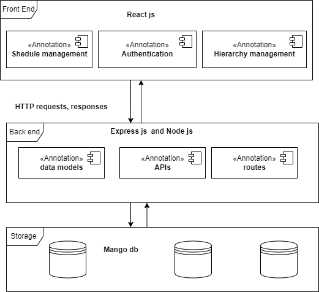

# Overview of the  Project
This project is intended to offer a schedule management service in an organization by letting you manage your tasks and the tasks of your immediate subordinates. This means you can assign or change the tasks assigned to your subordinates and your own. In this project, I see a learning opportunity and I attempt to achieve all the functions in only two interfaces the authentication interface and main interface.
## Functions
### Authentication
The application offers an authentication service.
### Hierarchy 
We use the details provided during authentication and derive your immediate subordinates.
### Schedule management
We provide a service to achieve crud operations for the tasks.

# Architecture of the project

# Instructions to run Project
## React js (front end) - also labelled as frond end folder
Dependencies and libraries
Install all dependencies using npm install
>bulma (css framework)
>react-router-dom
>lodash
>node-sass
>axios
>bootstrap
>react-bootstrap
with these installed you can start your application.
## Express js (API) - also labeled as API folder
Install the following dependencies
> initialize node js
>Cookie-parser
>Mongoose
>dot env
>bcrypt
with these installed you can start your server.
## Mango db.
Online version of mango db so no folder is provided
#### Git repository 
https://github.com/ghgharry2/task-.git

